# Ubuntu 18.04.1 installation

## Document conventions

- Arguments to terminal commands will be represented as [argument_name]. When you type in an argument do not include the square brackets unless explictly asked
- Every command is terminated with pressing enter. I won't show enter as something to be pressed

1. Download and install [virtualbox](https://www.virtualbox.org/wiki/Downloads)
2. Download the disc images for [Ubuntu 18.04.1](https://www.ubuntu.com/download/desktop/thank-you?version=18.04.1&architecture=amd64)
3. After you have installed virtualbox (my recommendation is to install it into a folder named C:\utils\virtualbox for windows users), complete the following steps after starting up virtual box


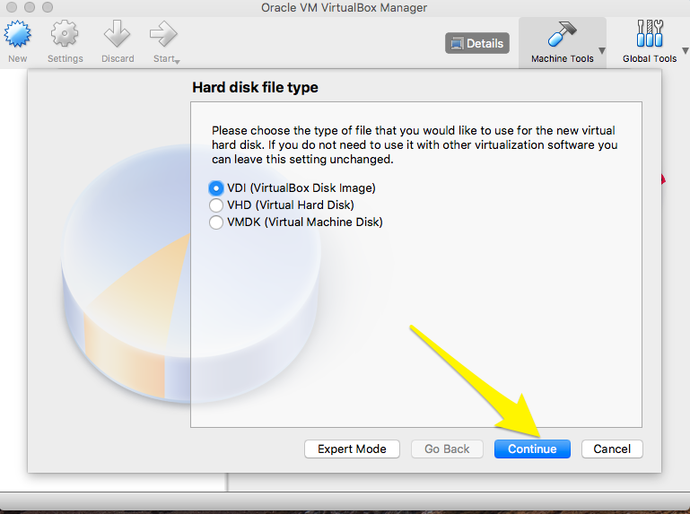


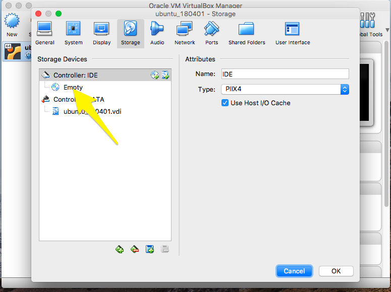


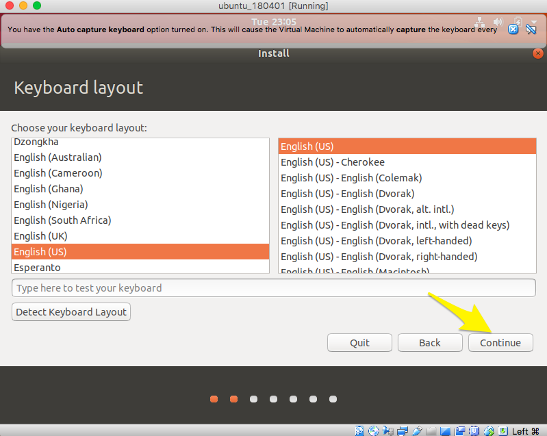


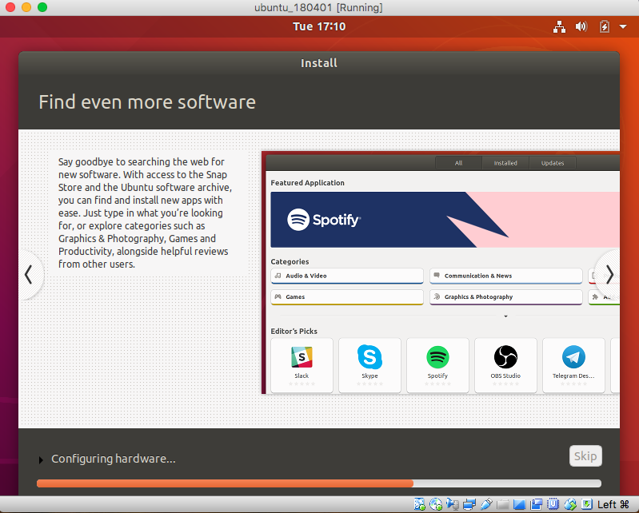
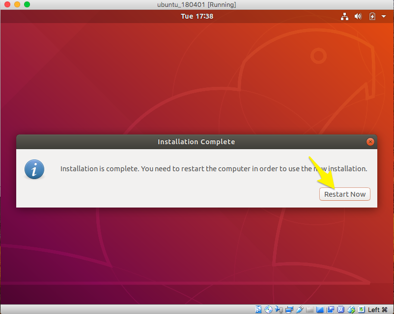
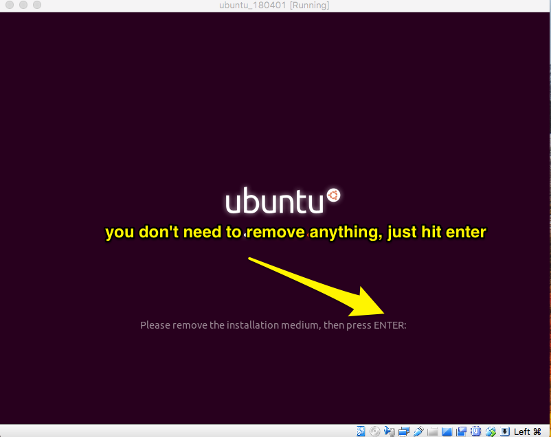


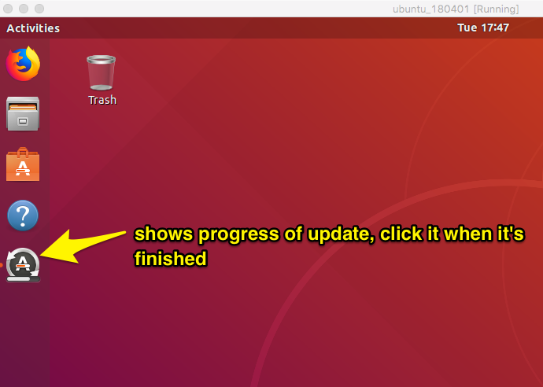


4. Log back into your ubuntu virtual machine and install the virtualbox guest additions. It should be on the VirtualBox menu -> Devices -> Insert Guest Additions CD Image. When you click on the correct menu item you should see the following:

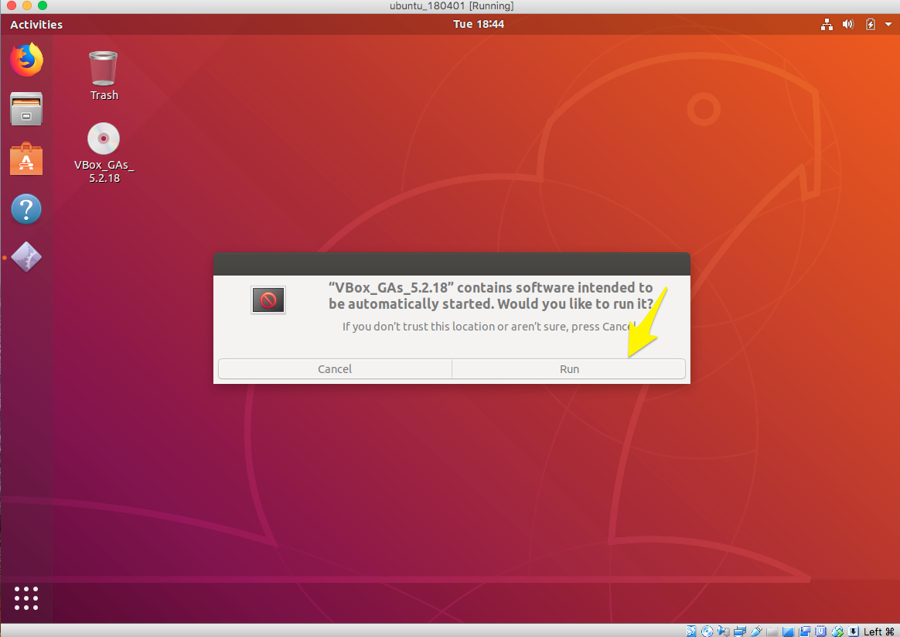

This will install a bunch of utilities into the Ubuntu instance that will help play better with your host operating system.

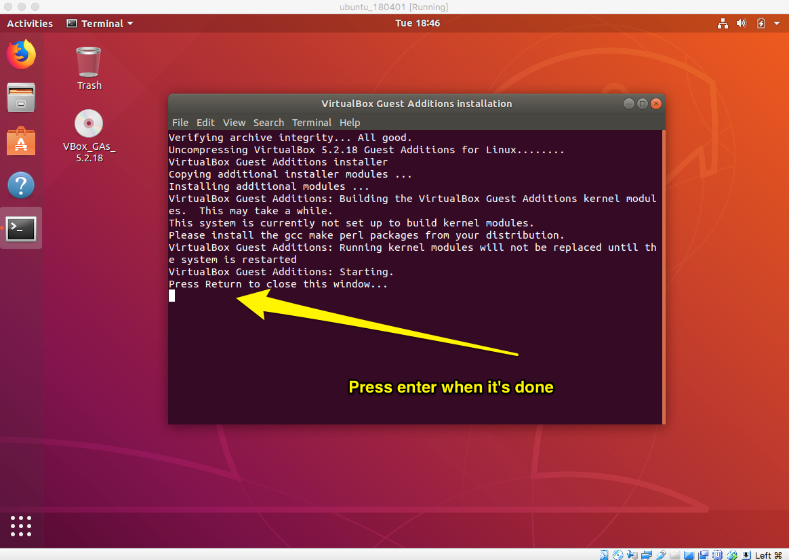

5. Restart your virtual machine


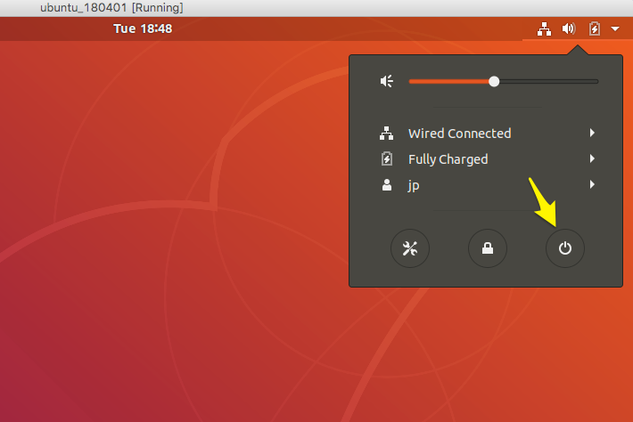
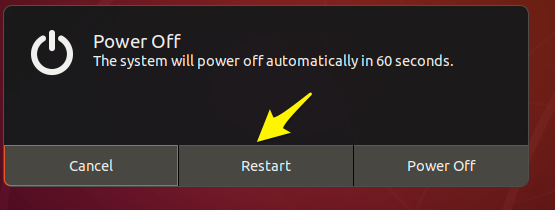

6. From this point on, it will be assumed that you know how to restart your virtual machine.
7. Log back into your virtual machine and open up a terminal prompt.
8. At the terminal prompt run the following commands

```bash
whoami
sudo usermod -aG sudo [value displayed from whoami command]
sudo usermod -aG vboxsf [value displayed from whoami command]
```
